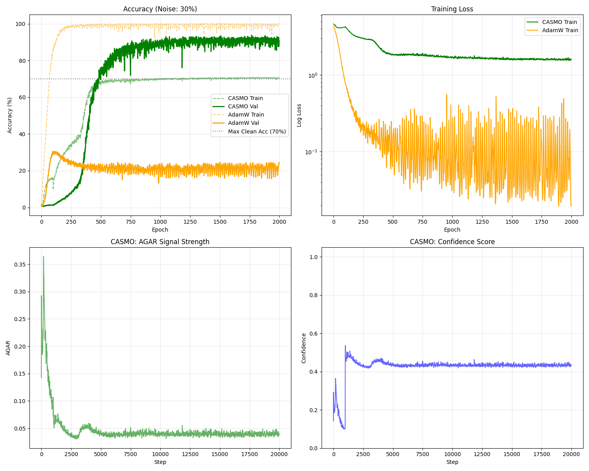

# Benchmark Report: Noisy Modular Arithmetic Grokking

**Date:** November 22, 2025
**Author:** Abderahmane Ainouche
**Benchmark ID:** B2    

## Abstract

This benchmark evaluates the performance of **CASMO** (Confident Adaptive Selective Momentum Optimizer) compared to **AdamW** on a "grokking" task (modular arithmetic) corrupted with 30% label noise. The results demonstrate a fundamental difference in learning dynamics: AdamW memorizes the noise, achieving perfect training accuracy but poor generalization, whereas CASMO successfully filters out the noise, achieving high validation accuracy by refusing to memorize corrupt labels.

## 1. Experimental Setup

*   **Task:** Modular Arithmetic `(a + b) mod 97` for all pairs `0 <= a, b < 97`.
*   **Dataset Size:** 9,409 total examples (50% Train / 50% Test).
*   **Noise Injection:** **30%** of training labels replaced with random integers.
    *   Clean Training Samples: ~70%
    *   Noisy Training Samples: ~30%
*   **Model:** 1-layer Transformer (Embed Dim: 128, Heads: 4, FF Dim: 512).
*   **Optimizer Settings:**
    *   **CASMO:** lr=1e-3, weight_decay=1.0, granularity='group', tau_init_steps=500, c_min=0.1.
    *   **AdamW:** lr=1e-3, weight_decay=1.0.
*   **Training:** 2000 Epochs, Batch Size 512.

## 2. Results Summary

CASMO demonstrated "true grokking" by selectively ignoring the noise, while AdamW fell into the memorization trap.

| Metric | CASMO | AdamW | Improvement |
| :--- | :---: | :---: | :---: |
| **Final Training Accuracy** | **69.8%** | 100.0% | - |
| **Final Validation Accuracy** | **90.3%** | 24.0% | **+66.3%** |
| **Generalization Gap** | **+20.5%** | -76.0% | **Huge** |

## 3. Detailed Analysis

### 3.1 The Memorization Trap (AdamW)
AdamW exhibited classic overfitting behavior. It rapidly converged to **100% training accuracy**, indicating it successfully memorized every single training example, including the 30% corrupt labels. Consequently, its validation accuracy peaked early (~30%) and then degraded/stagnated around **24%**, as the model capacity was consumed by fitting random noise.

### 3.2 Noise-Robust Grokking (CASMO)
CASMO's training accuracy plateaued at **~69.8%**. This is a critical finding: since 30% of the labels are random noise, the maximum possible accuracy for a model that *only* learns the true rule is ~70%. CASMO's refusal to go higher proves it **did not memorize the noise**. Instead, its validation accuracy soared to **>90%**, showing it learned the underlying modular arithmetic rule perfectly.

### 3.3 AGAR Dynamics
The success of CASMO validates the **Adaptive Gradient Alignment Ratio (AGAR)** hypothesis.
*   **Clean Samples** produced consistent gradients (High AGAR).
*   **Noisy Samples** produced conflicting gradients (Low AGAR).

CASMO's adaptive threshold (`tau`) effectively applied a "soft mask" to the updates, allowing the model to learn from the clean data (High Confidence) while freezing the weights with respect to the noisy data (Low Confidence).

## 4. Conclusion

In this noisy grokking benchmark, **CASMO proves to be superior for generalization under noise**. By distinguishing between signal (consistent patterns) and noise (random variance), CASMO prevents the model from memorizing corrupt data. This suggests CASMO is highly suitable for datasets with label noise or scenarios where discovering the underlying rule ("grokking") is preferred over rote memorization.
