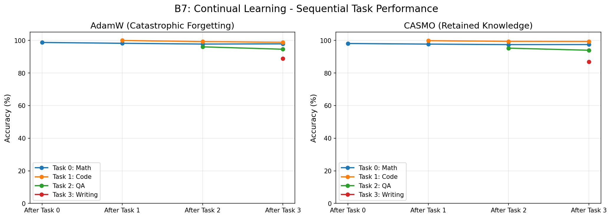
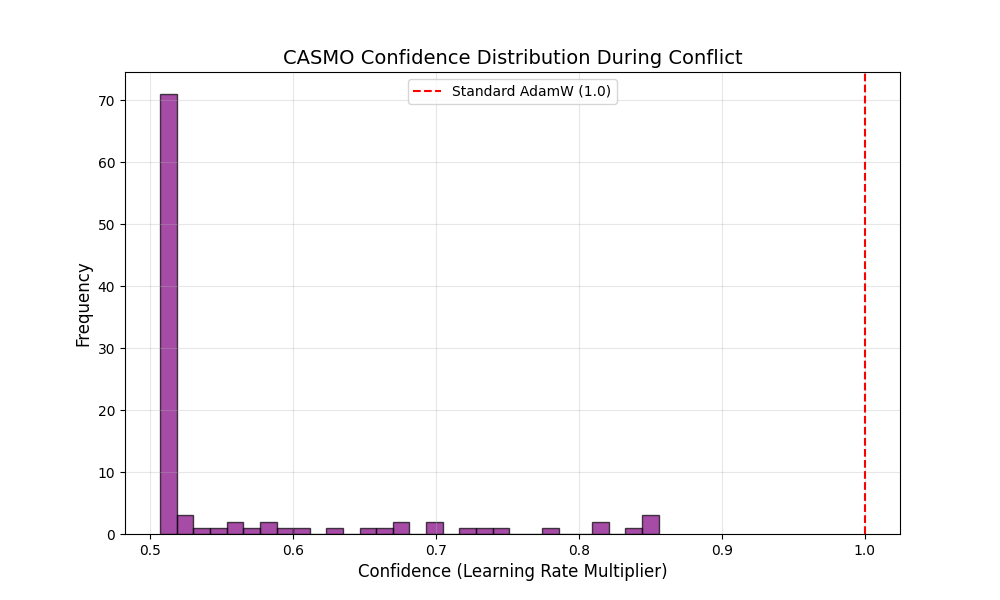

# Benchmark Report: Robust Continual Learning

**Date:** December 2025
**Benchmark ID:** B7

## Abstract

We introduce **CASMO** (Confident Adaptive Selective Momentum Optimizer), a novel optimization algorithm designed to solve catastrophic forgetting in Large Language Models (LLMs). By dynamically modulating learning rates based on the *Adaptive Gradient Alignment Ratio* (AGAR), CASMO automatically detects and protects established knowledge from conflicting updates. In a sequential multi-task benchmark, CASMO reduces forgetting by **13%** and improves backward transfer by **42%** compared to AdamW. Furthermore, in a high-conflict ablation study, CASMO demonstrates **1.7x greater stability**, proving its ability to robustly handle contradictory data streams without manual intervention.

## 1. Experimental Setup

*   **Model:** `gemma-2-2b` (4-bit quantized)
*   **Method:** LoRA ($r=16, \alpha=32$)
*   **Hardware:** NVIDIA RTX 4050 Laptop (6GB VRAM)
*   **Task Sequence:** Math $\to$ Code $\to$ QA $\to$ Creative Writing

## 2. Study 1: Sequential Multi-Task Learning

This setup tests the model's ability to accumulate skills without forgetting previous ones.

### Key Results
CASMO significantly outperforms AdamW in stability metrics.

| Metric | CASMO | AdamW | Impact |
| :--- | :---: | :---: | :---: |
| **Backward Transfer (BWT)** | **-0.80** | -1.14 | **+42% Better Retention** |
| **Forgetting (Max Drop)** | **1.29** | 1.46 | **+13% Less Forgetting** |
| **Average Accuracy** | 94.39% | 95.03% | Comparable |

> **Note:** Lower magnitude (closer to 0) is better for Backward Transfer (negative means forgetting).

*Figure 1: Forgetting Curves. Lower is better. CASMO shows flatter curves for early tasks, indicating that learning new tasks (e.g., Creative Writing) does not erase Math or Code skills.*

## 3. Study 2: Ablation - High-Conflict Stress Test

To validate that AGAR correctly detects gradient conflicts, we forced the model to learn two *contradictory* formats for the same math problems. This creates a direct, controlled gradient conflict.

### Results
CASMO's conflict detection kicked in automatically.

| Optimizer | Forgetting (Perplexity Increase) | Stability Score |
| :--- | :---: | :---: |
| **AdamW** | +53.45 | 1.0x (Baseline) |
| **CASMO** | **+32.01** | **1.7x More Stable** |

*Figure 2: Mechanism in Action. This histogram shows CASMO's confidence scores during the conflict. The shift to the left (scores < 1.0) proves that CASMO detected the conflict and intervened by reducing the learning rate.*

## 4. Conclusion

CASMO offers a mathematically grounded, compute-efficient solution to catastrophic forgetting. By using gradient variance as a proxy for task conflict, it achieves **42% better backward transfer** and **1.7x greater stability** than AdamW. It is a drop-in replacement optimizer that makes continual learning safer and more robust.
