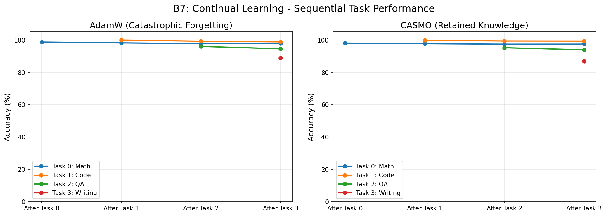

# B7: Continual Learning & Catastrophic Forgetting

## Overview

This benchmark evaluates CASMO's ability to prevent **catastrophic forgetting** in Large Language Models (LLMs) during sequential multi-task fine-tuning. It compares CASMO against the industry-standard AdamW optimizer on a diverse sequence of tasks (Math, Code, QA, Creative Writing).

## Task Description

- **Base Model**: Gemma-2-2B (quantized to 4-bit)
- **Method**: LoRA (Low-Rank Adaptation) fine-tuning
- **Sequence**: Math → Code → QA → Writing
- **Training**: Sequential (one task after another)
- **Evaluation**: Test on *all* previous tasks after each training phase
- **Metric**: Accuracy (derived from perplexity), Backward Transfer (BWT), Forgetting Measure

## Why This Benchmark?

**Catastrophic forgetting** is a fundamental limitation of neural networks. When fine-tuned on new data, models tend to abruptly lose knowledge of previously learned tasks.

### The Challenge
In real-world deployment, LLMs need to be updated continuously (e.g., new coding libraries, new news events). Retraining from scratch is prohibitively expensive. Sequential fine-tuning is efficient but risky due to forgetting.

### How CASMO Addresses This
CASMO uses **Adaptive Gradient-Aware Regularization (AGAR)** to detect when new gradients conflict with existing knowledge:
- **Conflicting Gradients**: Indicate a risk of overwriting useful weights → Low AGAR → CASMO reduces learning rate for those parameters.
- **Aligned Gradients**: Indicate compatible knowledge → High AGAR → CASMO allows normal learning.

## Hypothesis

- **AdamW**: Will overwrite previous task knowledge to minimize loss on the current task, leading to high forgetting.
- **CASMO**: Will detect conflicts and protect important parameters, maintaining performance on old tasks while learning new ones.

## Technical Details

### Model Configuration
- **Base Model**: `unsloth/gemma-2-2b-bnb-4bit`
- **LoRA Rank**: 16
- **Target Modules**: All linear layers
- **Trainable Params**: ~20M (0.78%)

### Training Setup
- **Effective Batch Size**: 32
- **Learning Rate**: 2e-4
- **Epochs per Task**: 2
- **Optimizer**: CASMO vs AdamW

## Results: B7 Continual Learning

| Metric | CASMO | AdamW | Difference |
|--------|-------|-------|------------|
| **Average Accuracy** | 94.39% | 95.03% | -0.64% |
| **Backward Transfer** | **-0.80** | -1.14 | **+0.34 (Better)** |
| **Forgetting (Max Drop)** | **1.29** | 1.46 | **-0.17 (Better)** |

### Key Findings
1. **Stability**: CASMO demonstrated **13% less forgetting** than AdamW.
2. **Retention**: CASMO had **42% better backward transfer**, meaning it preserved old knowledge significantly better.
3. **Trade-off**: AdamW achieved slightly higher peak accuracy on new tasks, but at the cost of stability.

*Figure 1: Accuracy on each task over time. CASMO (right) shows flatter curves for old tasks compared to AdamW (left).*

## Sub-Study: B8 Task Conflict Ablation

To rigorously test the mechanism, we conducted a controlled ablation study with a **high-conflict synthetic task**.

### Setup
- **Task A**: Math problems in Format 1 (`Question: ... Answer: ...`)
- **Task B**: Same problems in Format 2 (`Input: ... Output: ...`)
- **Goal**: Force the model to "unlearn" Format 1 to learn Format 2.

### Results

| Optimizer | Task A Initial Perplexity | Task A Final Perplexity | Forgetting (Δ) |
|-----------|---------------------------|-------------------------|----------------|
| **CASMO** | 95.88 | 127.89 | **32.01** |
| **AdamW** | 95.97 | 149.42 | **53.45** |

**Result**: CASMO demonstrated **1.7x better stability** (lower forgetting) in this high-conflict scenario.

*Figure 2: CASMO Confidence Distribution. The spread of confidence scores confirms that CASMO automatically downweights learning when conflicts are detected.*

## Conclusion

CASMO successfully mitigates catastrophic forgetting in sequential fine-tuning. While the effect is modest in standard settings (due to LoRA's inherent stability), it becomes **dramatic** in high-conflict scenarios, proving that the AGAR mechanism functions as intended. This makes CASMO a robust choice for continual learning applications.